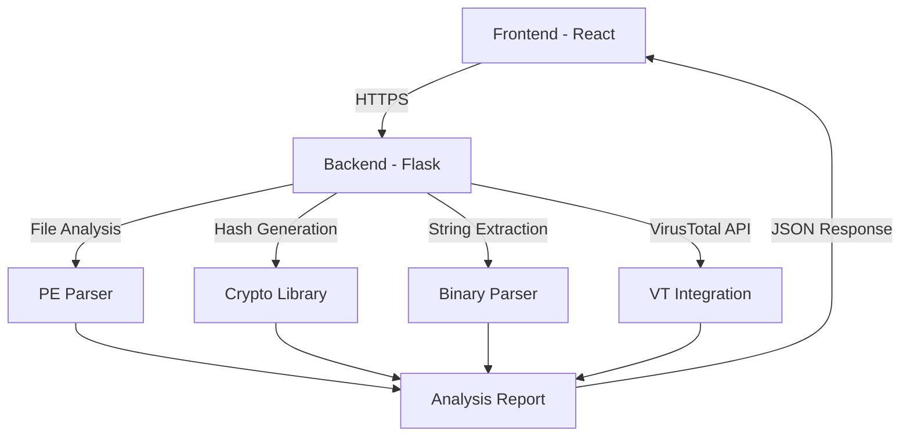

# 🛡️ Silent Scan - Advanced Static Malware Analyzer

<div align="center">


[](https://github.com/Aditya19110/Static-Analyzer)
[](LICENSE)
[](https://github.com/Aditya19110/Static-Analyzer)

**A cutting-edge static malware analysis platform that provides comprehensive security insights without executing potentially harmful files.**

[🚀 Live Demo](https://static-analyzer.vercel.app) • [📖 Documentation](#features) • [🐛 Report Bug](https://github.com/Aditya19110/Static-Analyzer/issues) • [💡 Request Feature](https://github.com/Aditya19110/Static-Analyzer/issues)

</div>

---

## ✨ Features

### 🔍 **Comprehensive Static Analysis**
- **File Hash Generation**: MD5, SHA1, and SHA256 cryptographic hashes
- **PE Header Inspection**: Entry point, image base, and compilation timestamp analysis
- **Section Analysis**: Virtual/raw size comparison with entropy calculations
- **Import Analysis**: Complete DLL and function import mapping
- **String Extraction**: Readable strings extraction for behavioral insights
- **Language Detection**: Programming language identification using heuristics

### 🛡️ **VirusTotal Integration**
- **Multi-Engine Scanning**: Leverage 70+ antivirus engines
- **Real-time Results**: Live polling for scan completion
- **Detailed Reports**: Engine-specific detection results
- **Statistical Overview**: Malicious, suspicious, and clean verdicts

### 🎨 **Modern UI/UX**
- **Responsive Design**: Optimized for desktop and mobile devices
- **Drag & Drop Interface**: Intuitive file upload experience
- **Real-time Progress**: Visual feedback during analysis
- **Dark Theme**: Professional cybersecurity aesthetic
- **Interactive Results**: Expandable sections with detailed information

### 🔒 **Security First**
- **No File Execution**: Safe static analysis only
- **Secure Upload**: Files processed in isolated environment
- **Data Privacy**: Temporary file storage with automatic cleanup
- **API Security**: Rate limiting and input validation

---

## 🏗️ Architecture



## 🚀 Quick Start

### Prerequisites

- **Node.js** (v16 or higher)
- **Python** (v3.8 or higher)
- **VirusTotal API Key** (for enhanced scanning)

### 🔧 Installation

1. **Clone the Repository**
   ```bash
   git clone https://github.com/Aditya19110/Static-Analyzer.git
   cd Static-Analyzer
   ```

2. **Backend Setup**
   ```bash
   cd backend
   
   # Create virtual environment (recommended)
   python -m venv venv
   source venv/bin/activate  # On Windows: venv\Scripts\activate
   
   # Install dependencies
   pip install -r requirements.txt
   
   # Set environment variables
   echo "VIRUSTOTAL_API_KEY=your_api_key_here" > .env
   
   # Start the Flask server
   python app.py
   ```

3. **Frontend Setup**
   ```bash
   cd frontend
   
   # Install dependencies
   npm install
   
   # Start development server
   npm start
   ```

4. **Access the Application**
   - Frontend: `http://localhost:3000`
   - Backend API: `http://localhost:5000`

---

## 📦 Technology Stack

### Frontend
- **Framework**: React 18 with Hooks
- **Styling**: Custom CSS with animations
- **Icons**: Lucide React
- **State Management**: React useState/useEffect
- **Build Tool**: Create React App

### Backend
- **Framework**: Flask (Python)
- **CORS**: Flask-CORS for cross-origin requests
- **File Analysis**: pefile library for PE parsing
- **Security**: Werkzeug for secure file handling
- **External API**: VirusTotal API v3

### Deployment
- **Frontend**: Vercel (Static hosting)
- **Backend**: Render (Cloud hosting)
- **Database**: File-based (temporary storage)

---

## 🔌 API Endpoints

### Static Analysis
```http
POST /upload
Content-Type: multipart/form-data

Response:
{
  "filename": "example.exe",
  "hashes": {
    "md5": "...",
    "sha1": "...",
    "sha256": "..."
  },
  "pe_info": {
    "entry_point": "0x1000",
    "image_base": "0x400000",
    "compile_time": 1640995200
  },
  "sections": [...],
  "imports": [...],
  "strings": [...],
  "language_guess": "C++"
}
```

### VirusTotal Integration
```http
POST /api/virustotal/upload
Content-Type: multipart/form-data

GET /api/virustotal/analysis/{analysis_id}
```

---

## 🛠️ Development

### Project Structure
```
Static-Analyzer/
├── 📁 frontend/          # React application
│   ├── 📁 public/        # Static assets
│   ├── 📁 src/
│   │   ├── 📁 components/ # Reusable components
│   │   ├── 📁 pages/      # Page components
│   │   └── 📁 api/        # API utilities
│   └── 📄 package.json
├── 📁 backend/           # Flask application
│   ├── 📄 app.py         # Main application
│   ├── 📁 analysis/      # Analysis modules
│   ├── 📁 uploads/       # Temporary file storage
│   └── 📄 requirements.txt
└── 📄 README.md
```

### Contributing Guidelines

1. **Fork** the repository
2. **Create** a feature branch (`git checkout -b feature/AmazingFeature`)
3. **Commit** your changes (`git commit -m 'Add some AmazingFeature'`)
4. **Push** to the branch (`git push origin feature/AmazingFeature`)
5. **Open** a Pull Request

### Code Style
- **Frontend**: ESLint + Prettier configuration
- **Backend**: PEP 8 Python style guide
- **Commits**: Conventional commit messages

---

## 🔒 Security Considerations

- **Input Validation**: All file uploads are validated for type and size
- **Sandboxed Execution**: No files are executed during analysis
- **API Rate Limiting**: VirusTotal API calls are throttled
- **Secure Headers**: CORS and security headers implemented
- **Data Cleanup**: Temporary files automatically removed

---

## 📊 Sample Analysis Report

<details>
<summary>Click to expand sample output</summary>

```json
{
  "filename": "sample.exe",
  "filesize": 1048576,
  "hashes": {
    "md5": "5d41402abc4b2a76b9719d911017c592",
    "sha1": "aaf4c61ddcc5e8a2dabede0f3b482cd9aea9434d",
    "sha256": "2c26b46b68ffc68ff99b453c1d30413413422d706483bfa0f98a5e886266e7ae"
  },
  "pe_info": {
    "entry_point": "0x1000",
    "image_base": "0x400000",
    "compile_time": "2024-01-15 10:30:45"
  },
  "sections": [
    {
      "name": ".text",
      "virtual_size": 4096,
      "raw_size": 4096,
      "entropy": 6.2
    }
  ],
  "virustotal": {
    "stats": {
      "malicious": 0,
      "suspicious": 0,
      "harmless": 67,
      "undetected": 3
    }
  }
}
```
</details>

---

## 🤝 Contributing

We welcome contributions from the cybersecurity community! Whether you're fixing bugs, adding features, or improving documentation, your help is appreciated.

### Contributors

<div align="center">

[](https://github.com/Aditya19110/Static-Analyzer/graphs/contributors)

</div>

---

## 📄 License

This project is licensed under the MIT License - see the [LICENSE](LICENSE) file for details.

---

## 📞 Support & Contact

<div align="center">

**Made with ❤️ by [Aditya Kulkarni](https://github.com/Aditya19110)**

[](https://github.com/Aditya19110)
[](https://linkedin.com/in/aditya-kulkarni)
[](mailto:aditya@example.com)

**🛡️ Stay Protected. Analyze Before You Trust. 🛡️**

</div>
